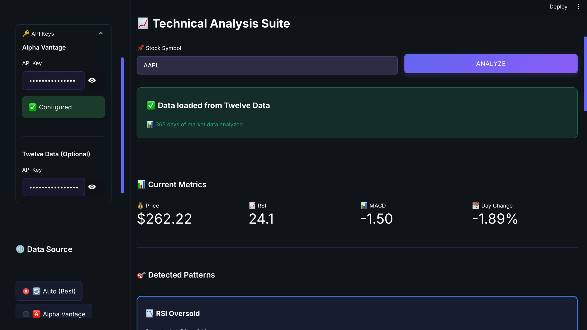
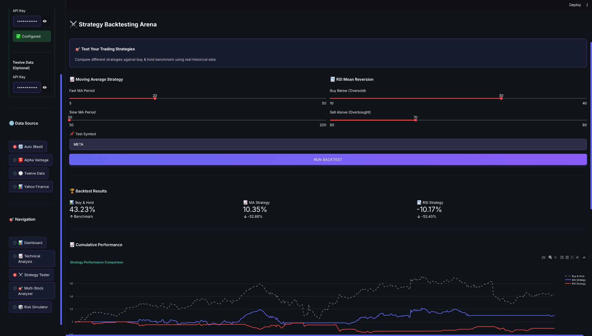
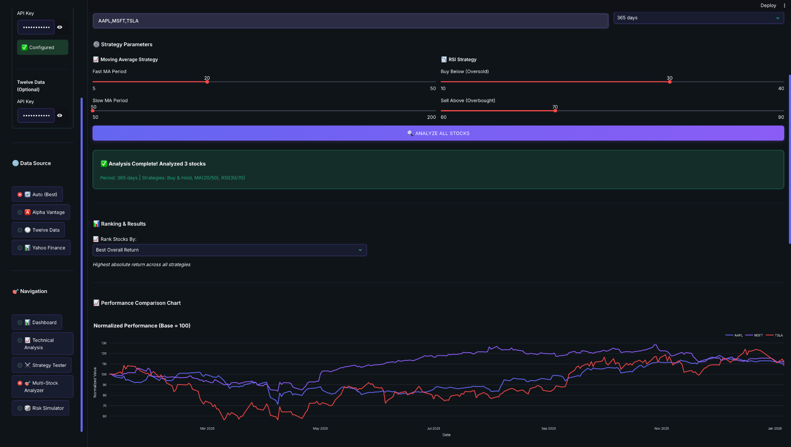
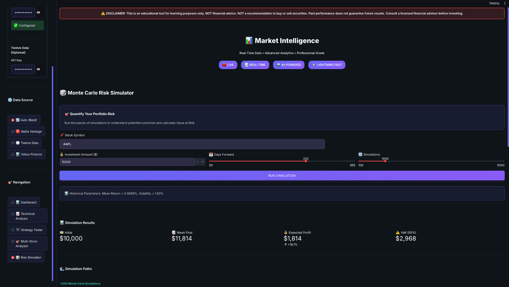

# 📊 Market Intelligence Platform

**Real-Time Stock Analysis • Strategy Backtesting • Risk Assessment**

---

## ⚠️ CRITICAL DISCLAIMER - READ FIRST

<div align="center">

### 🚨 FOR EDUCATIONAL PURPOSES ONLY 🚨

**THIS IS NOT FINANCIAL ADVICE**

This application is an **educational tool** designed to help users learn about technical analysis, trading strategies, and risk assessment. It is **NOT** intended to provide financial, investment, or trading advice.

**⚠️ Past performance does not guarantee future results**  
**⚠️ All investing involves risk of loss**  
**⚠️ Consult a licensed financial advisor before investing**

By using this application, you acknowledge that you have read and agree to the [full legal disclaimer](LEGAL_DISCLAIMER.md).

</div>

---

## 📋 Features

### 📊 **Real-Time Dashboard**
- Live market data from Alpha Vantage, Twelve Data, and Yahoo Finance
- Multi-stock comparison and performance tracking
- Normalized performance charts

### 📈 **Technical Analysis**
- RSI, MACD, Bollinger Bands, Moving Averages
- Pattern detection (Golden Cross, Death Cross, etc.)
- Interactive candlestick charts

### ⚔️ **Strategy Backtesting**
- Test Moving Average and RSI strategies
- Compare against Buy & Hold benchmark
- Historical performance analysis

### 🎯 **Multi-Stock Analyzer** (NEW!)
- Analyze up to 5 stocks simultaneously
- Compare strategies across multiple stocks
- Dynamic ranking (Best Return, Best Strategy, Risk-Adjusted)
- Performance comparison charts
- Smart recommendations (Strong Buy, Buy, Hold, Avoid)
- Investment calculator with allocation methods
- Portfolio summary and expected returns

### 🎲 **Monte Carlo Risk Simulator**
- Run thousands of simulations
- Calculate Value at Risk (VaR)
- Visualize potential outcomes

---

## 🚀 Quick Start

### Prerequisites
```bash
Python 3.8+
pip
```

### Installation
```bash
# Clone the repository
git clone https://github.com/VaibhavAG-02/market-intelligence.git
cd market-intelligence

# Install dependencies
pip install -r requirements.txt

# Run the application
streamlit run app.py
```

### API Keys (Optional but Recommended)
- **Alpha Vantage**: Get free key at https://www.alphavantage.co/support/#api-key
- **Twelve Data**: Get free key at https://twelvedata.com/

---

## 📸 Screenshots

### Real-Time Market Dashboard
Live data from professional APIs with current prices and performance metrics.


### Technical Analysis Suite
RSI, MACD indicators and automatic pattern detection for any stock.



### Strategy Backtesting Arena
Compare moving average and RSI strategies against buy & hold benchmark.



### Multi-Stock Analyzer
Analyze multiple stocks simultaneously with performance rankings and comparisons.



### Monte Carlo Risk Simulator
Run thousands of simulations to calculate Value at Risk and expected outcomes.



---

## 🛡️ Legal Protection

### What You MUST Include:

1. **✅ In the App**: 
   - Disclaimer banner at the top (ALREADY ADDED ✅)
   - Comprehensive footer disclaimer (ALREADY ADDED ✅)

2. **✅ In GitHub README**: 
   - Prominent warning at the top (THIS FILE ✅)
   - Link to full legal disclaimer (ABOVE ✅)

3. **✅ Separate Legal File**: 
   - Complete terms and conditions (LEGAL_DISCLAIMER.md ✅)

4. **✅ On LinkedIn/Portfolio**:
   - Always mention "educational purposes"
   - Never claim it provides financial advice
   - Emphasize learning and research tool

---

## ⚖️ Legal Disclaimers

### NOT Financial Advice
This application does NOT:
- ❌ Provide personalized investment advice
- ❌ Recommend buying or selling specific securities
- ❌ Guarantee any returns or performance
- ❌ Replace professional financial guidance

### Educational Purpose
This application DOES:
- ✅ Provide educational tools for learning
- ✅ Demonstrate technical analysis concepts
- ✅ Offer backtesting capabilities for research
- ✅ Visualize historical market data

### Use at Your Own Risk
- You are responsible for your own investment decisions
- Past performance does not predict future results
- All data may contain errors or delays
- Consult licensed professionals before investing
- The creator(s) assume no liability for any losses

**[Read Full Legal Disclaimer](LEGAL_DISCLAIMER.md)**

---

## 🎓 Intended Audience

✅ **Students** learning finance and trading  
✅ **Beginner investors** researching before investing  
✅ **Educators** teaching technical analysis  
✅ **Researchers** studying trading strategies  
✅ **Developers** learning financial applications

❌ **NOT for professional day traders**  
❌ **NOT for high-frequency trading**  
❌ **NOT for managing client funds**

---

## 📊 Data Sources

- **Alpha Vantage**: Real-time and historical stock data
- **Yahoo Finance**: Market data (free tier, may be delayed)
- **Twelve Data**: Real-time quotes and historical data

**Note**: Free API tiers have rate limits and may include data delays (5-20 minutes).

---

## 🤝 Contributing

Contributions are welcome! However, please ensure that:
- Any financial calculations are clearly marked as educational
- No claims are made about profitability or guarantees
- All contributions maintain educational focus

---

## 📜 License

[Specify your license, e.g., MIT License]

---

## 📞 Contact

- **Email**: [vaibhavag0207@gmail.com]
- **GitHub**: [github.com/VaibhavAG-02]
- **LinkedIn**: [[linkedin.com/in/yourprofile](https://www.linkedin.com/in/vaibhav-sathe-115507194/]

---

## 🙏 Acknowledgments

- Built with [Streamlit](https://streamlit.io/)
- Data from [Alpha Vantage](https://www.alphavantage.co/), [Yahoo Finance](https://finance.yahoo.com/), [Twelve Data](https://twelvedata.com/)
- Charts powered by [Plotly](https://plotly.com/)

---

## ⚠️ Final Reminder

**This is an educational project.** If you're making real investment decisions:

1. 🧑‍💼 Consult a licensed financial advisor
2. 📚 Do extensive research from multiple sources
3. 🎯 Understand your risk tolerance
4. 💰 Never invest money you can't afford to lose
5. 🔍 Verify all data independently

**Happy Learning! 📚**

---

<div align="center">

**© 2026 Market Intelligence Platform**  
*For Educational Purposes Only • Not Financial Advice*

[Read Full Disclaimer](LEGAL_DISCLAIMER.md) | [Report Issues](https://github.com/yourusername/market-intelligence/issues)

</div>
